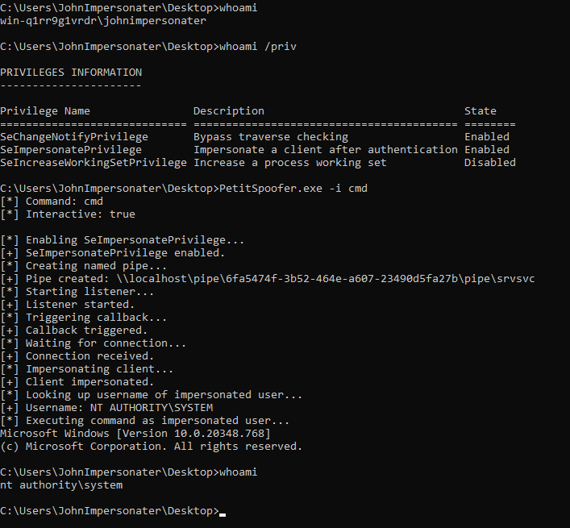

# PetitSpoofer

Escalate from SeImpersonatePrivilege to SYSTEM using named pipe impersonation and MS-EFSR. Tested on Windows 10, Windows 11, Windows Server 2012 R2, and Windows Server 2022.

Combines the techniques from [PrintSpoofer](https://github.com/itm4n/PrintSpoofer/) and [PetitPotam](https://github.com/topotam/PetitPotam) with some inspiration from [EfsPotato](https://github.com/zcgonvh/EfsPotato).

## Usage

```
C:\>PetitSpoofer.exe
Usage: PetitSpoofer.exe [-h] [-i] <cmd>
  -h    Print this text and exit.
  -i    Interact with spawned process.
  cmd   Command to execute.
```


